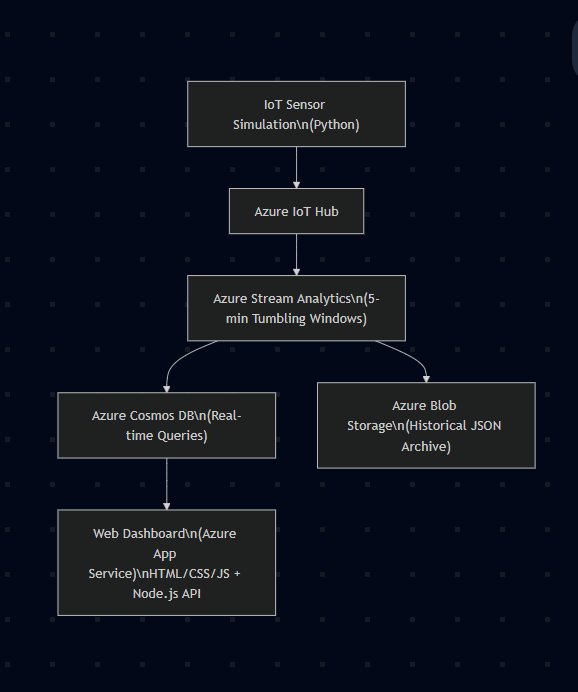

# CST8916 - Final Project Assignment

## Description of system: Rideau Canal Ice Monitoring & Safety System

This project implements a real-time IoT data streaming and monitoring solution for the Rideau Canal Skateway.
Simulated IoT sensors generate environmental data (ice thickness, temperature, snow accumulation), which is ingested via Azure IoT Hub, processed using Azure Stream Analytics, stored in Cosmos DB, archived in Blob Storage, and displayed through a fully functional web dashboard hosted on Azure App Service.

---

- **Name:** Fayz Reshid
- **Student ID:** 041066116
- **Course:** CST8916 - Fall 2025

## Repository Links

### 1. Main Documentation Repository

- **URL:** https://github.com/resh2024/rideau-canal-monitoring
- **Description:** Complete project documentation, architecture, screenshots, and guides

### 2. Sensor Simulation Repository

- **URL:** https://github.com/resh2024/rideau-canal-sensor-simulation
- **Description:** IoT sensor simulator code

### 3. Web Dashboard Repository

- **URL:** https://github.com/resh2024/rideau-canal_dashboard
- **Description:** Web dashboard application

---

## Scenario Overview

### Problem Statement

The Rideau Canal Skateway requires continuous monitoring to ensure public safety. Ice conditions change rapidly throughout the winter season, and manual data collection is slow and inconsistent. An automated solution is needed to collect, process, and visualize ice metrics in real-time.

### System Objectives

- Collect real-time environmental sensor data from three canal locations

- Process and aggregate the data every 5 minutes

- Determine safety status automatically

- Store and archive data efficiently

- Present live and historical trends through a web dashboard

- Deploy the entire solution using Azure cloud services

---

## System Architecture

### Architecture Diagram

### Data Flow Explanation

- IoT Sensor Simulation generates JSON payloads every 10 seconds

- Messages are sent to Azure IoT Hub

- Stream Analytics processes events using 5-minute tumbling windows

Aggregated results flow into:

- Azure Cosmos DB (real-time queries for the dashboard)

- Azure Blob Storage (historical archive in JSON format)

- Web Dashboard (HTML/CSS/JS + Node.js backend) fetches data from Cosmos DB

### Application hosted via Azure App Service: Azure Services Used

- Azure IoT Hub – device ingestion

- Azure Stream Analytics – real-time stream processing

- Azure Cosmos DB – fast NoSQL storage

- Azure Blob Storage – long-term archival

- Azure App Service – dashboard hosting

## Demo

- **Video Demo:** (https://www.youtube.com/watch?v=vBiHWDl5aE0)

---

## Implementation Overview

### IoT Sensor Simulation

Repository: https://github.com/resh2024/rideau-canal-sensor-simulation

Python script simulates three IoT devices

- Sends telemetry every 10 seconds

- Uses Azure IoT SDK

### Azure IoT Hub Configuration

- Three devices registered: Dows Lake, Fifth Avenue, NAC

- Device connection strings loaded through .env

### Azure Stream Analytics Job

- Input: IoT Hub

- Outputs: Cosmos DB + Blob Storage

- Tumbling window: 5 minutes

- Query includes averages, min/max, safety logic

SELECT
System.Timestamp AS windowEnd,
location,

    AVG(ice_thickness_cm) AS avgIceThickness,
    MIN(ice_thickness_cm) AS minIceThickness,
    MAX(ice_thickness_cm) AS maxIceThickness,

    AVG(surface_temp_c) AS avgSurfaceTemp,
    MIN(surface_temp_c) AS minSurfaceTemp,
    MAX(surface_temp_c) AS maxSurfaceTemp,

    MAX(snow_accumulation_cm) AS maxSnowAccumulation,
    AVG(external_temp_c) AS avgExternalTemp,

    COUNT(*) AS readingCount,

    CASE
        WHEN AVG(ice_thickness_cm) >= 30 THEN 'Safe'
        WHEN AVG(ice_thickness_cm) >= 20 THEN 'Caution'
        ELSE 'Unsafe'
    END AS safetyStatus

INTO
SensorAggregations
FROM
rideaucanalhub TIMESTAMP BY timestamp
GROUP BY
TUMBLINGWINDOW(minute, 5),
location;

### Cosmos DB Setup

- Database: RideauCanalDB

- Container: SensorAggregations

- Partition key: /location

- Each document represents a single 5-minute aggregated window

### Blob Storage Configuration

- Container: historical-data

- - JSON output path pattern:
    aggregations/{date}/{time}.json

### Web Dashboard

- Repository: https://github.com/resh2024/rideau-canal_dashboard

- Node.js + Express backend

- Frontend: HTML, CSS, Vanilla JS, Chart.js

- API endpoints: /api/latest, /api/history/:location, /api/status

### Azure App Service Deployment

- Node.js app deployed to App Service

- Environment variables store Cosmos DB credentials

## Setup Instructions

### Prerequisites

- Azure Subscription

- Node.js 18+

- Python 3.10+

- Azure CLI

- Git

### High-Level Setup Steps

- Clone the sensor, dashboard, and documentation repos

- Create IoT Hub and register three devices

- Deploy Stream Analytics job

- Create Cosmos DB + Blob Storage

- Deploy dashboard to Azure App Service

- Run sensor simulation locally to push data

- Confirm dashboard displays live data

Detailed Instructions

- See instructions inside:
  /rideau-canal-sensor-simulation/README.md
  /rideau-canal-dashboard/README.md

## Results and Analysis

Sample Outputs

- Sensor JSON

- Aggregated records in Cosmos DB

- Blob storage archived snapshots

- System Performance Observations

- End-to-end latency ~2–5 seconds

- Stream Analytics consistent 5-min windows

- Dashboard auto-refresh every 30 seconds

## Challenges and Solutions

Challenge 1: IoT Events not reaching Cosmos DB

- Solution: Reconfigured Stream Analytics outputs and corrected field names.

Challenge 2: Null values in aggregations

- Solution: Fixed IoT property casing and mapping in ASA query.

Challenge 3: Dashboard not displaying metrics

- Solution: Updated backend API field names and frontend parsing logic.

## AI Tools Disclosure

- AI assistance (ChatGPT) used for:

- Formatting documentation

- Troubleshooting code and Azure configuration

- Improving query and server logic

- All final code implementation, testing, deployment, and architecture created by me.
